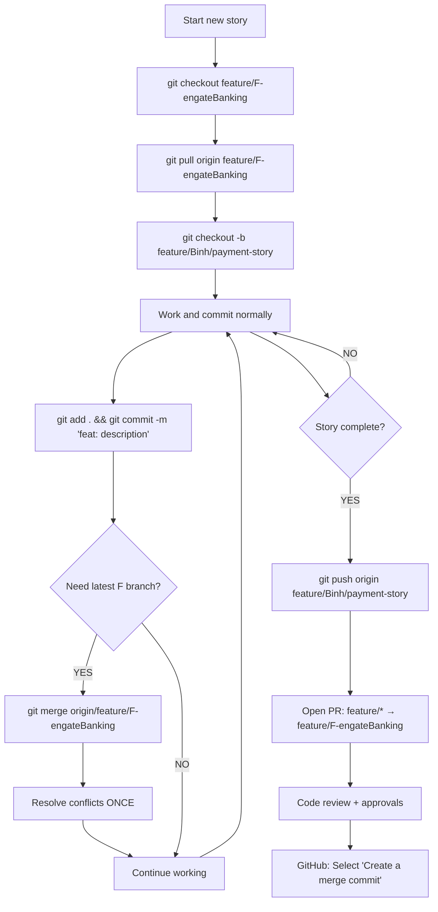
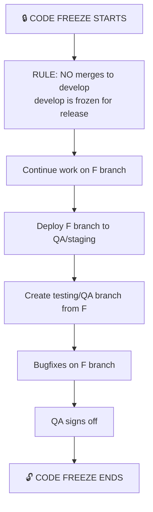
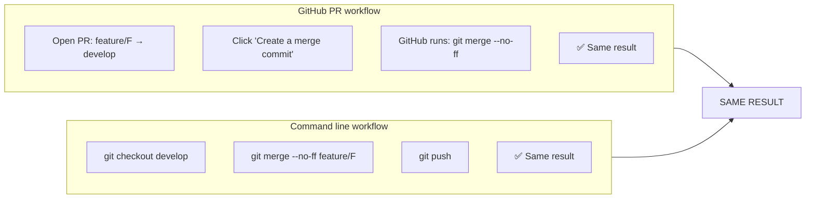
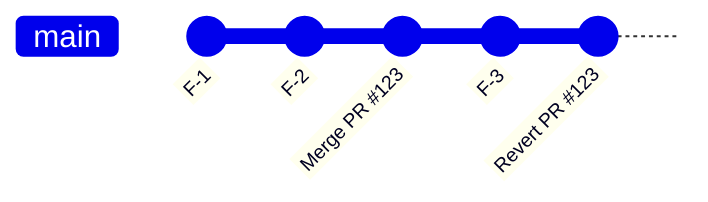
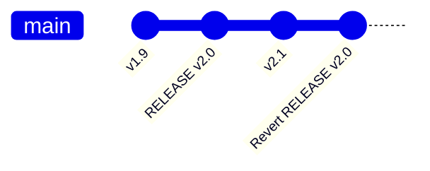
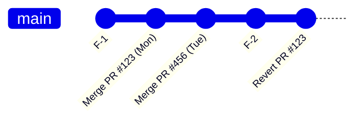
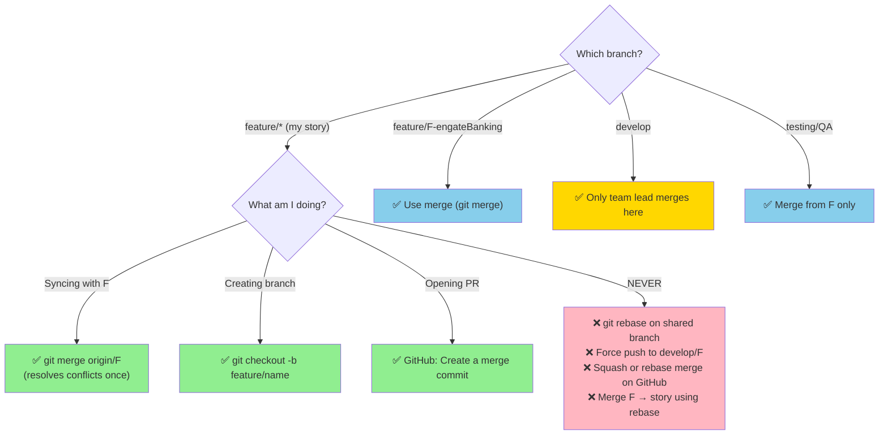
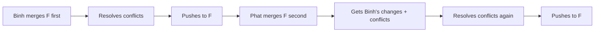
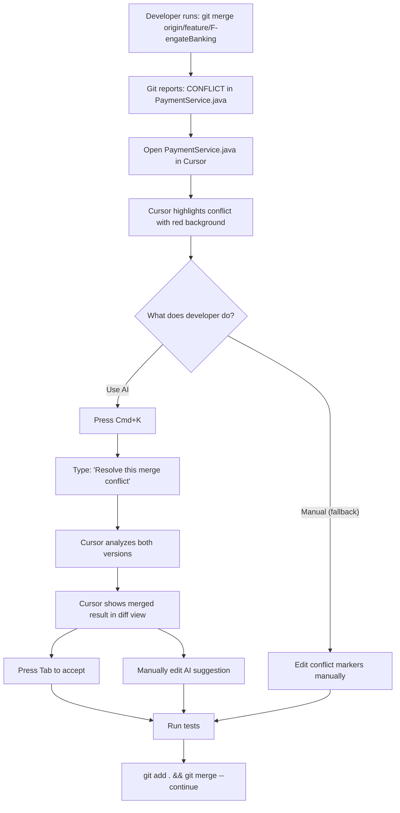

---
tags:
  - Engineering/git
version: 0.0.1
---
# Git Branching & Merge Strategy Proposal
## Banking Team: Credit Banking Feature (4,5-Months Project)

**Document Version:** 1.0  
**Date:** March 2026  
**Project:** Engate Banking (4-month feature)  
**Production:** Direct from `develop` (no production branch)

---

## Table of Contents

1. Executive Summary
2. Branch Hierarchy
3. Branch Definitions
4. GitHub Settings
5. Daily Workflow for Developers
6. Weekly Sync Process
7. Code Freeze Workflow
8. Release Process
9. Reverting Scenarios
10. Audit Trail
11. Team Rules
12. Decision Matrix
13. Trade off
14. Common Scenarios (Q&A)
15. AI Enhancements
16. Approval Signatures

---

## 1. Executive Summary

This proposal defines a Git strategy for the 4-month `feature/F-engateBanking` project with multiple developers (Binh, Phat, and team). The strategy balances **audit compliance** (banking requirements), **developer productivity**, and **history clarity**.

**Core Decision:** Use **"Create a merge commit"** on GitHub for all merges to preserve audit trail, commit SHAs, and timestamps, while accepting merge commits in history.

---

## 2. Branch Hierarchy

```mermaid
gitGraph
    commit id: "init"
    
    branch develop
    checkout develop
    commit id: "v1.0"
    commit id: "v1.1 (BAU)"
    commit id: "v1.2 (BAU)"
    
    branch feature/F-engateBanking
    checkout feature/F-engateBanking
    commit id: "F-1: setup"
    commit id: "F-2: config"
    
    checkout develop
    commit id: "v1.3 (BAU)"
    
    checkout feature/F-engateBanking
    merge develop id: "SYNC: develop → F (week 2)"
    commit id: "F-3: core logic"
    
    branch feature/Binh/payment
    checkout feature/Binh/payment
    commit id: "Binh 1: add payment API"
    commit id: "Binh 2: integrate gateway"
    commit id: "Binh 3: add retry logic"
    
    checkout feature/F-engateBanking
    commit id: "F-4: auth layer"
    
    branch feature/Phat/report
    checkout feature/Phat/report
    commit id: "Phat 1: report generator"
    commit id: "Phat 2: export PDF"
    
    checkout develop
    commit id: "v1.4 (BAU)"
    commit id: "v1.5 (BAU)"
    
    checkout feature/F-engateBanking
    merge develop id: "SYNC: develop → F (week 4)"
    
    checkout feature/Binh/payment
    merge feature/F-engateBanking id: "MERGE: F → Binh (sync)"
    commit id: "Binh 4: error handling"
    commit id: "Binh 5: unit tests"
    
    checkout feature/F-engateBanking
    merge feature/Binh/payment id: "MERGE: Binh → F (PR #123)"
    
    checkout feature/Phat/report
    merge feature/F-engateBanking id: "MERGE: F → Phat (sync)"
    commit id: "Phat 3: dashboard"
    commit id: "Phat 4: schedule reports"
    
    checkout feature/F-engateBanking
    merge feature/Phat/report id: "MERGE: Phat → F (PR #456)"
    commit id: "F-5: integration"
    
    checkout develop
    commit id: "v1.6 (BAU)"
    
    checkout feature/F-engateBanking
    merge develop id: "SYNC: final sync before freeze"
    commit id: "F-6: polish"
    
    checkout develop
    commit id: "🔒 CODE FREEZE START"
    
    checkout feature/F-engateBanking
    commit id: "F-7: freeze bugfix 1"
    commit id: "F-8: freeze bugfix 2"
    
    branch testing/QA
    checkout testing/QA
    commit id: "QA: regression test 1"
    commit id: "QA: regression test 2"
    
    checkout feature/F-engateBanking
    merge testing/QA id: "QA signoff"
    commit id: "F-9: critical fix"
    
    checkout develop
    commit id: "🔓 CODE FREEZE END"
    
    checkout feature/F-engateBanking
    merge develop id: "SYNC: after freeze"
    
    checkout develop
    merge feature/F-engateBanking id: "🚀 RELEASE v2.0"
    commit id: "v2.0 production"
```



### Text Representation of Branch Hierarchy

```
develop (integration + DIRECT RELEASE to production)
    │
    │ (merge every 2 weeks)
    │
    ▼
feature/F-engateBanking (4-month project, shared)
    │
    ├── feature/Binh/payment (private, single dev)
    ├── feature/Phat/report (private, single dev)
    └── feature/others/* (private, single dev)
    │
    │ (deploy to QA during freeze)
    │
    ▼
testing/QA (code freeze period)
    │
    │ (signoff)
    │
    ▼
feature/F-engateBanking
    │
    │ (merge after freeze)
    │
    ▼
develop ──► PRODUCTION (deployed directly)
```

---

## 3. Branch Definitions

| Branch                    | Type        | Lifespan                              | Who can push         | Merge strategy                                    | Lock |
| ------------------------- | ----------- | ------------------------------------- | -------------------- | :------------------------------------------------ | :--- |
| `develop`                 | Integration | Forever                               | Team lead (via PR)   | Merge from feature F branch, Merge from BAU works | Yes  |
| `feature/F-engateBanking` | Shared      | 4 months For Work (1 Year for Metric) | Team lead            | Merge from develop + feature stories              | Yes  |
| `feature/*` (stories)     | Private     | Days to 2 weeks                       | Individual developer | PR to F branch (Create merge commit)              | No   |
| `testing/QA`              | Shared      | Freeze period                         | QA team              | Merge from F branch                               | No   |
| staging/snyk              | Shared      | Forever                               | Individual developer |                                                   | No   |

**Important:** `develop` is deployed directly to production. No `main` - Sync `develop` to `main` - monthly

---

## 4. GitHub Settings

```yaml
Repository Settings → Merge button:
  ☑️ Allow merge commits (Create a merge commit)
  ☐ Allow squash merging
  ☐ Allow rebase merging
  
  ☑️ Automatically delete head branches
  ☑️ Always suggest updating pull requests
  
Branch protection rules (develop, feature/F-engateBanking):
  ☑️ Require pull request reviews (1 approval)
  ☑️ Dismiss stale reviews
  ☑️ Require status checks to pass
  ☑️ Require linear history (optional - discuss with team)
```

**Why only "Create a merge commit":**
- Preserves original commit SHAs (audit requirement - [[Flow]])
- Preserves original timestamps (banking compliance [[Flow]])
- PR link in commit message (`#123`)
- Revert entire PR with one command
- Resolve conflicts once, not per commit

---

## 5. Daily Workflow for Developers



### Step-by-Step Commands

```bash
# STEP 1: Create story branch from F
git checkout feature/F-engateBanking
git pull origin feature/F-engateBanking
git checkout -b feature/Binh/payment-story

# STEP 2: Work and commit normally
git add .
git commit -m "feat: add payment API"
git commit -m "feat: integrate gateway"
git commit -m "feat: add retry logic"
git commit -m "feat: add logging"
git commit -m "feat: error handling"
git commit -m "test: add unit tests"

# STEP 3: Weekly sync with F (USE MERGE, NOT REBASE)
git fetch origin
git merge origin/feature/F-engateBanking
# Resolve conflicts ONCE
git add .
git commit -m "Merge F into Binh/payment-story"
git push origin feature/Binh/payment-story

# STEP 4: Complete story and open PR
git push origin feature/Binh/payment-story
# Open PR in GitHub: feature/Binh/payment-story → feature/F-engateBanking

# STEP 5: After PR approval, team lead merges using "Create a merge commit"
```

---

## 6. Weekly Sync Process (develop → F)

**Every 2 weeks**, Roster's lead runs:

```bash
git checkout feature/F-engateBanking
git pull origin feature/F-engateBanking
git merge origin/develop -m "Sync: merge develop into F (week X)"
git push origin feature/F-engateBanking
```

```mermaid
gitGraph
    commit id: "develop-1"
    commit id: "develop-2"
    commit id: "develop-3"
    
    branch feature/F
    checkout feature/F
    commit id: "F-1"
    commit id: "F-2"
    
    checkout develop
    commit id: "develop-4"
    
    checkout feature/F
    merge develop id: "SYNC: week 2"
    commit id: "F-3"
```

**Why merge, not rebase:**
- Preserves integration timeline [[Flow]]
- Safe for shared branch
- No force push needed
- Shows audit trail of when develop was pulled into F

---

## 7. Code Freeze Workflow




### During Freeze:
- `develop` branch is **FROZEN** (no commits, no merges)
- Work continues on `feature/F-engateBanking`
- Bugfixes committed directly to F (small fixes only)
- Large changes go to story branches, merge to F when ready
- After QA signs off → freeze ends → F merges to `develop`

---

## 8. Release Process

**After code freeze ends:**

```bash
# Team lead runs this ONE command
git checkout develop
git pull origin develop
git merge --no-ff feature/F-engateBanking -m "Release: Engate Banking v2.0"
git push origin develop

# Then deploy develop to production
```

### GitHub PR Does the Same Thing

**Why `--no-ff` for release:**
- Creates a clear "release checkpoint" in history
- Makes it easy to find all changes for this release
- Easier to revert entire release if needed
- Shows audit trail of when release happened

---

## 9. Reverting Scenarios

### Scenario 1: Revert a Single PR (Binh's payment feature)
**Problem:** PR #123 (Binh's payment feature) needs to be undone.

```bash
# Find the merge commit SHA
git log --oneline --grep="#123"

# Output: 9a8b7c6 Merge pull request #123 from feature/Binh/payment

# Revert with ONE command
git checkout feature/F-engateBanking
git revert -m 1 9a8b7c6 -m "Revert PR #123: payment feature"
git push origin feature/F-engateBanking
```



**Result:** ONE revert commit undoes all 6 commits from PR #123.
[[Git a manual revert]]

---
### Scenario 2: Revert an Entire Release (Emergency)
**Problem:** Release v2.0 needs to be undone from production.

```bash
# Find the release merge commit
git log --oneline develop --grep="Release: Engate Banking"

# Output: a1b2c3d Release: Engate Banking v2.0

# Revert the entire release
git checkout develop
git revert -m 1 a1b2c3d -m "Emergency revert: Release v2.0"
git push origin develop

# Deploy develop to production (now without v2.0)
```



**Result:** One command reverts ALL changes from the entire F branch.

---
### Scenario 3: Revert After Multiple Merges
**Problem:** PR #123 merged on Monday, PR #456 merged on Tuesday, need to revert only PR #123.



```bash
# Still ONE command - Git handles it correctly
git revert -m 1 9a8b7c6 -m "Revert PR #123"
```

**Git automatically:** 
- Reverts only changes from PR #123
- Preserves changes from PR #456
- Creates one clean revert commit

---
### Scenario 4: Revert with Conflict Resolution

**Problem:** Other work has been done after the PR, causing conflicts when reverting.

```bash
# Use -n to not auto-commit
git revert -n -m 1 9a8b7c6

# Resolve conflicts manually
git add .
git revert --continue

# Or abort if too complex
git revert --abort
```

---
## 10. Audit Trail
### Tracing Code to PR (For Auditors)

```bash
# Question: "Which PR introduced this line of code?"
git blame BankingService.java

# Output shows commit SHA: 8z7y6x5
# 8z7y6x5 (Binh 2026-03-10) feat: add payment API

# Find which PR this commit belongs to
git log --oneline 8z7y6x5^..8z7y6x5

# Shows: "Merge pull request #123 from feature/Binh/payment"

# Click link in GitHub → PR #123 → All discussions, approvals, commits
```

**Audit complete in under 1 minute.**
### Finding All Commits from a PR

```bash
# Show all commits from PR #123
git log --oneline --grep="#123" --ancestry-path

# Or use GitHub CLI
gh pr view 123 --json commits
```
### Finding When a Release Was Deployed

```bash
# Show release history
git log --oneline develop --grep="Release:"

# Output:
# a1b2c3d Release: Engate Banking v2.0
# d4e5f6g Release: Engate Banking v1.9
# g7h8i9j Release: Engate Banking v1.8
```

---
## 11. Team Rules

```markdown
# OUR GIT RULES (Banking Team)

## BRANCHING
1. ✅ ALWAYS branch from feature/F-engateBanking
2. ✅ Use naming convention: feature/{name}/{story-description}
3. ✅ Delete branch after PR merge (GitHub auto-delete)

## NEVER DO THESE
4. ❌ NEVER rebase a shared branch (develop, F)
5. ❌ NEVER force push to develop or F branch
6. ❌ NEVER use "Squash and merge" on GitHub
7. ❌ NEVER use "Rebase and merge" on GitHub
8. ❌ NEVER deploy directly from feature branches

## SYNCING
9.  ✅ Use `git merge` to sync F into your story branch
10. ✅ NEVER use `git rebase` to sync (loses timestamps)
11. ✅ Resolve conflicts ONCE (not per commit)

## PULL REQUESTS
12. ✅ On GitHub: ALWAYS choose "Create a merge commit"
13. ✅ Require 1 approval before merge
14. ✅ Write meaningful PR descriptions

## CODE FREEZE
15. ✅ During code freeze: NO commits to develop
16. ✅ Freeze period: work continues on F branch only

## COMMIT MESSAGES
17. ✅ feat: add payment API
18. ✅ fix: resolve null pointer
19. ✅ test: add unit tests
20. ✅ docs: update README
```

---

## 12. Decision Matrix



---
## 13. Tradeoff
[[Accept the garbage commits as Stragety]]
[[History Management]]
## 14. Common Scenarios (Q&A)

### Q1: What if I accidentally used rebase instead of merge?

```bash
# Before pushing, abort the rebase
git rebase --abort

# Then do the correct merge
git merge origin/feature/F-engateBanking
```

### Q2: What if I already pushed a rebased branch?

```bash
# Force push is dangerous on shared branches
# But on your PRIVATE story branch, it's OK
git push --force-with-lease origin feature/Binh/payment

# Notify team lead that you force-pushed
```

### Q3: What if I have conflicts during merge?

```bash
# Git shows which files have conflicts
# Fix them in your IDE

git add .
git merge --continue

# NEVER do git commit directly after resolving
```

### Q4: What if I need to revert but PR was merged weeks ago?

```bash
# Still works the same way
git revert -m 1 <merge-SHA>

# Git automatically handles all changes since then
```

### Q5: What if two developers have conflicts in the same file?



This is normal. The second developer resolves conflicts based on the first developer's merged changes.

### Q6: How to handle a hotfix during code freeze?

```bash
# During freeze, fix directly on F branch
git checkout feature/F-engateBanking
git commit -m "hotfix: critical banking fix"
git push origin feature/F-engateBanking

# Deploy to QA for testing
# QA signs off
# Continue freeze
```

### Q7: What if QA finds a bug that requires major changes?

```bash
# Create a story branch from F
git checkout feature/F-engateBanking
git checkout -b feature/Binh/fix-critical-bug

# Fix the bug with multiple commits
git commit -m "fix: resolve calculation error"
git commit -m "test: add regression tests"

# PR back to F (Create merge commit)
# QA retests
# Merge to F
```

### Q8: How to see the difference between merge strategies?

| Action | Create merge commit | Squash | Rebase |
|--------|---------------------|--------|--------|
| Preserves original SHAs | ✅ YES | ❌ NO | ❌ NO |
| Preserves timestamps | ✅ YES | ❌ NO | ❌ NO |
| PR link in commit | ✅ YES | ✅ YES | ❌ NO |
| Revert with 1 command | ✅ YES | ✅ YES | ❌ NO |
| Clean linear history | ❌ NO | ✅ YES | ✅ YES |
| Resolve conflicts once | ✅ YES | ✅ YES | ❌ NO |

---
### Q9: When I can't not make a revert PR in GIT Hub what i should do
## 15. AI Enhancements
AI tools can reduce merge conflict resolution time by **70-80%** and catch integration issues **before** they reach `develop`. For a 4-month project with multiple developers, this saves **40-60 hours** of manual conflict resolution.
### ### The Cursor Conflict Resolution Workflow

Cursor has a **built-in merge tool** that's essentially AI-powered.
**Features:**
- Detects conflicts automatically
- Shows side-by-side diff with AI suggestions
- One-click "AI resolve" for 80% of conflicts
- For complex ones, chat with AI about the conflict
####  Cursor Time Savings for This Project

|Scenario|Without Cursor|With Cursor|Savings|
|---|---|---|---|
|Simple conflict (imports, formatting)|5-10 min|10-30 sec|**95%**|
|Medium conflict (different methods)|10-20 min|1-2 min|**90%**|
|Complex logic conflict|20-45 min|3-5 min|**85%**|
|Multi-file conflict (3 files)|30-60 min|3-5 min|**90%**|
|Understanding what changed|5-10 min|30 sec (ask AI)|**90%**|


--- 
## 16. Appendix: Quick Command Reference

| Action | Command |
|--------|---------|
| Create story branch | `git checkout -b feature/Binh/story feature/F-engateBanking` |
| Daily commit | `git add . && git commit -m "feat: message"` |
| Sync with F (weekly) | `git merge origin/feature/F-engateBanking` |
| Push branch | `git push origin feature/Binh/story` |
| Sync develop → F (lead) | `git merge origin/develop` |
| Merge PR (lead) | GitHub: "Create a merge commit" |
| Release to develop | `git merge --no-ff feature/F-engateBanking` |
| Revert PR | `git revert -m 1 <merge-SHA>` |
| Revert release | `git revert -m 1 <release-merge-SHA>` |
| Abort bad rebase | `git rebase --abort` |
| Force push (private branch only) | `git push --force-with-lease` |

---

## Document Version History

| Version | Date | Author | Changes |
|---------|------|--------|---------|
| 1.0 | March 2026 | Tech Lead | Initial proposal |

---

*End of Proposal*

---
[[Git Branching & Merge Strategy Proposal v2.0]]