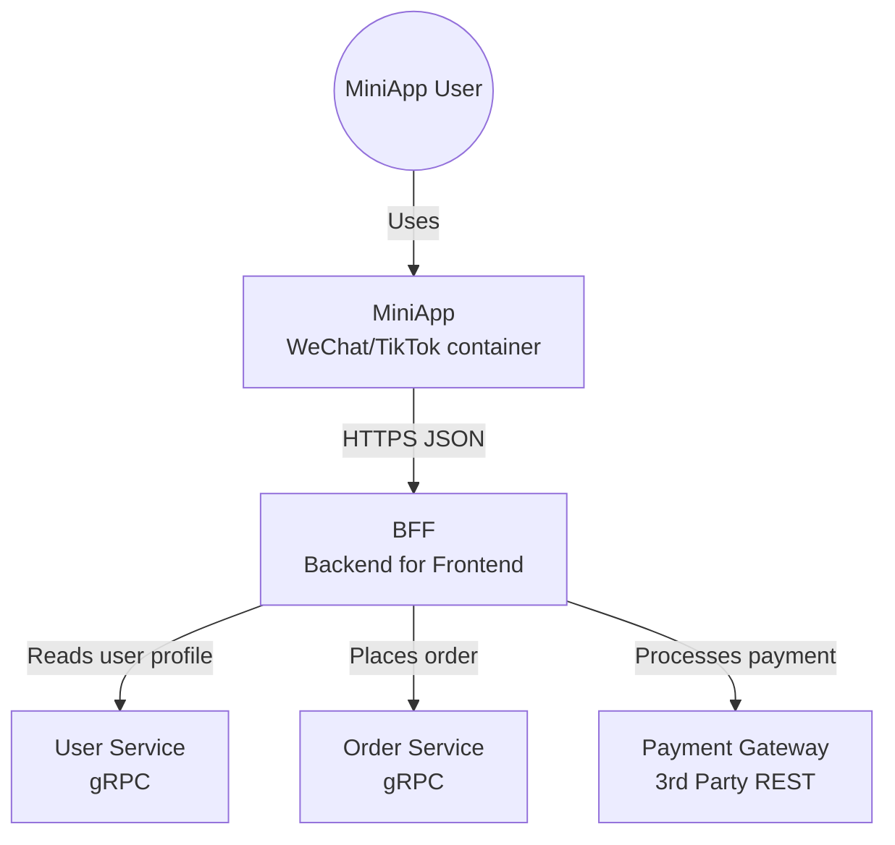
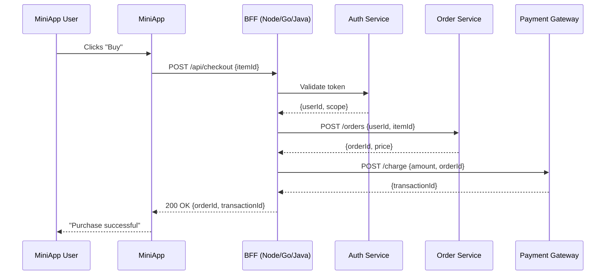
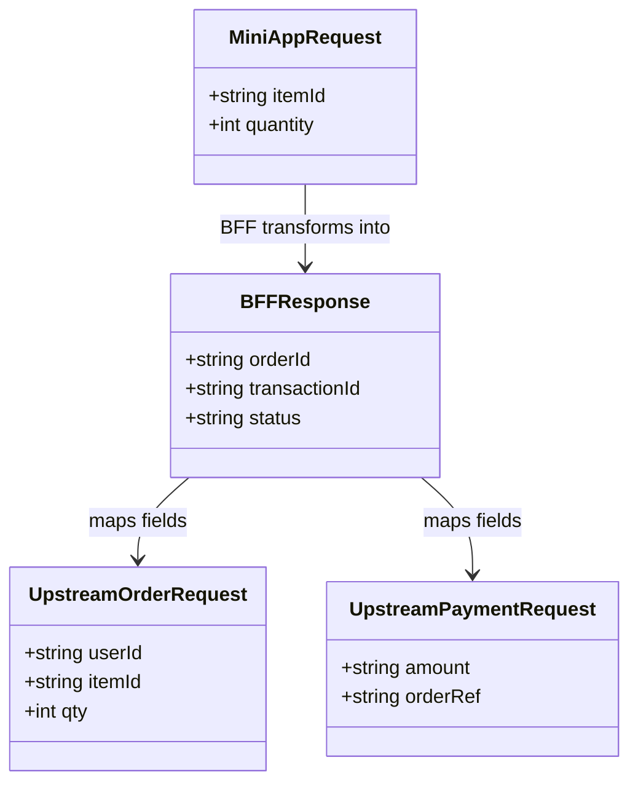
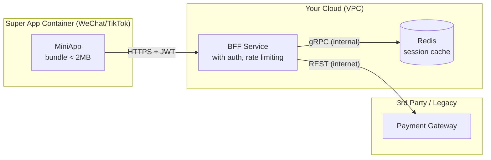
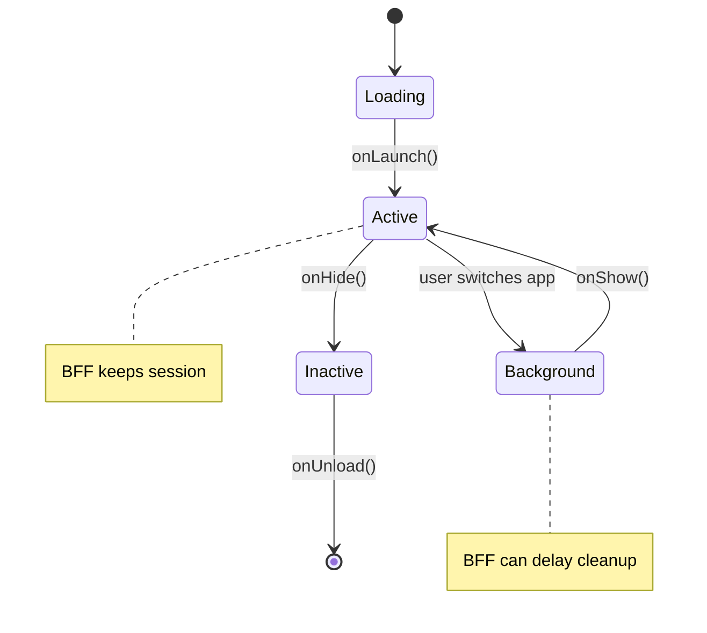

---
tags:
  - promptEngineering
  - LLM/Prompt
publish: "true"
copilot-command-context-menu-enabled: true
copilot-command-slash-enabled: true
copilot-command-context-menu-order: 10
copilot-command-model-key: ""
copilot-command-last-used: 0
---
This is a great follow-up. For a **MiniApp + BFF (Backend for Frontend)** architecture, the right diagram strategy is critical because the complexity sits not in deep backend logic, but in **orchestration** (BFF aggregating multiple downstream services) and **mapping** (MiniApp calls → BFF transforms → upstream APIs).

Here’s a **practical, human-first diagram strategy** using Mermaid.js, ordered by how a new engineer should consume them.

---

## 1. Start with a **System Context Diagram** (C4 Level 1)
### Corrected Version: System Context Diagram (using standard `flowchart`)
**Goal:** Answer *“What are the external actors and systems?”*



**Why this works for humans:**  
One glance → knows what the BFF talks to, and that MiniApp never directly hits upstream services.

---

## 2. Add a **Request Flow Sequence Diagram** (Most Important for MiniApp+BFF)
**Goal:** Show the *exact order* of calls for a critical user action (e.g., “Buy Now”).



**Why this is gold for humans:**  
- Shows **fan-out** (BFF calls 3 services sequentially/parallel)  
- Reveals **where latency hides**  
- Makes **error handling gaps** obvious (what if payment fails after order created?)

---

## 3. Create a **BFF API + Upstream Mapping Table** (Not pure Mermaid, but essential)
Diagrams can’t show field-level mapping well. Use a Markdown table alongside a simple Mermaid class diagram.

**Mermaid class diagram (high-level entities):**


**Accompanying table (in Markdown):**
| MiniApp Field | BFF Internal | Upstream A (Order) | Upstream B (Payment) |
|---------------|--------------|--------------------|----------------------|
| `itemId`      | `sku`        | `productCode`      | - |
| `quantity`    | `qty`        | `amount`           | - |
| (derived)     | `totalPrice` | -                  | `amount` |

---

## 4. Show **Deployment & Network Boundary** (Crucial for MiniApps)
MiniApps run inside a super-app (WeChat, LINE, etc.) with **domain whitelisting** and **size limits**. Humans need to know what’s inside vs outside.



**Why humans love this:** Immediately sees latency risks (internet calls) and security boundaries.

---

## 5. Optional: **State Machine Diagram** for MiniApp Lifecycle
MiniApps have unique constraints (cold start, background, close). A state diagram helps frontend + BFF engineers coordinate.



---

## Summary: The Minimal Viable Diagram Set for a New Engineer

| Diagram | Tool | Time to understand project |
|---------|------|----------------------------|
| System Context (C4) | Mermaid | 2 min |
| Critical Sequence Diagram | Mermaid | 5 min |
| API mapping table + class sketch | Markdown + Mermaid | 10 min |
| Deployment boundary | Mermaid flowchart | 3 min |

**Pro tip for your AI workflow:**  
Feed the BFF’s `routes/` folder + one typical MiniApp request JSON to an LLM and ask:

> *“Draw a Mermaid sequence diagram of the BFF handling this request, including all downstream calls. Then generate an API mapping table from request to each upstream.”*

That produces the *highest-leverage artifact* for a human inheriting the project.

# Prompt templates
Absolutely. Here's a **curated list of prompt templates** for generating MiniApp+BFF diagrams using AI (Claude, ChatGPT, etc.). Each template is structured so you can copy-paste and fill in your specific context.

---

## 1. System Context Diagram (Flowchart)

**Prompt:**
```
I have a MiniApp with a BFF (Backend for Frontend). Generate a Mermaid flowchart showing the system context.

Actors and systems:
- MiniApp user (person)
- MiniApp (runs in WeChat/TikTok container)
- BFF (our orchestration layer)
- Downstream services: [list your services, e.g., User Service, Order Service, Payment Gateway]

Show arrows for:
- User → MiniApp
- MiniApp → BFF (HTTPS)
- BFF → each downstream service (indicate protocol: gRPC/REST/GraphQL)

Use flowchart TB format.
```

---

## 2. Critical User Journey Sequence Diagram

**Prompt:**
```
I need a Mermaid sequence diagram for a MiniApp + BFF architecture.

User action: [e.g., "User checks out a shopping cart"]

Participants:
- MiniApp User
- MiniApp (frontend)
- BFF (our backend)
- [Service A]
- [Service B]
- [Service C]

Steps:
1. User clicks button
2. MiniApp calls BFF endpoint [POST /api/endpoint] with payload {example}
3. BFF validates JWT with [Auth Service]
4. BFF calls [Service A] to [do something]
5. BFF calls [Service B] to [do something]
6. BFF transforms responses
7. BFF returns consolidated result to MiniApp
8. MiniApp shows success to user

Please also show error paths: [e.g., what if step 4 fails?]

Use sequenceDiagram syntax.
```

---

## 3. API Mapping + Transformation Diagram

**Prompt:**
```
I have a MiniApp that sends a request to my BFF. The BFF then maps fields to two different upstream APIs.

MiniApp request JSON:
```json
{
  "itemId": "ABC123",
  "qty": 2,
  "userId": "user_001"
}
```

Upstream API 1 (Order Service) expects:
```json
{
  "productCode": "ABC123",
  "amount": 2,
  "customerRef": "user_001"
}
```

Upstream API 2 (Payment Service) expects:
```json
{
  "orderReference": "from_order_response",
  "totalPrice": 99.98
}
```

Generate:
1. A Mermaid classDiagram showing the three schemas (MiniAppRequest, OrderRequest, PaymentRequest)
2. A Markdown table showing field mappings: MiniApp field → BFF internal → Order field → Payment field
3. A short note on where the price calculation (qty * unit price) happens

---

## 4. Deployment & Network Boundary Diagram

**Prompt:**
```
Draw a Mermaid flowchart showing deployment boundaries for a MiniApp.

Three zones:
1. Super App Container (WeChat/TikTok) — contains only the MiniApp bundle (<2MB)
2. Our Cloud VPC — contains BFF service + Redis cache + [other internal services]
3. External/3rd Party — contains [Payment Gateway, etc.]

Show:
- MiniApp → BFF (HTTPS + JWT)
- BFF → Redis (internal gRPC)
- BFF → External API (REST over internet)

Use subgraph for each zone. Label all arrows with protocol.
```
## 5. MiniApp Lifecycle State Machine

**Prompt:**
```
I need a Mermaid stateDiagram-v2 for a MiniApp lifecycle inside a super app (WeChat/TikTok).

States: Loading, Active, Background, Inactive, Unloaded

Transitions:
- onLaunch() → Loading → Active
- onShow() → Background → Active  
- onHide() → Active → Background
- onUnload() → Active/Background/Inactive → [*]

Add notes to explain:
- When BFF should keep session alive
- When BFF can clean up session

Use stateDiagram-v2 syntax.
```

---

## 6. Data Flow for a Specific BFF Endpoint

**Prompt:**
```
I have a BFF endpoint [GET /api/orders/{userId}] that:

1. Receives request from MiniApp
2. Calls Order Service to fetch orders
3. Calls User Service to fetch user profile (parallel call)
4. Merges orders with user name
5. Returns merged JSON to MiniApp

Generate a Mermaid sequence diagram showing:
- Parallel calls (Order Service + User Service happening simultaneously)
- The merge step in BFF
- Response back to MiniApp

Use sequenceDiagram with par/and blocks.
```

---

## 7. Error Handling & Retry Logic

**Prompt:**
```
Generate a Mermaid flowchart showing error handling in my MiniApp BFF.

Flow:
1. MiniApp calls BFF endpoint
2. BFF validates auth → if fail, return 401
3. BFF calls upstream Service A → if timeout, retry up to 3 times
4. If retries exhausted → fallback to cached data
5. BFF calls upstream Service B → if fails, return partial response + warning header
6. BFF returns response to MiniApp

Use flowchart TD. Show decision diamonds for error conditions. Label all failure paths.
```

---

## 8. Complete Onboarding Diagram Set (Batch Prompt)

**Prompt:**
```
I am a senior engineer inheriting a MiniApp + BFF project. Please generate ALL of the following Mermaid diagrams in one response:

1. System context flowchart (MiniApp, BFF, User Service, Order Service, Payment)
2. Sequence diagram for "user places order" flow
3. Deployment boundary diagram (super app container, our cloud, external)
4. Class diagram showing MiniApp request → BFF internal → upstream API mappings
5. State machine for MiniApp lifecycle

For each diagram, add a 1-sentence caption explaining what a new engineer should look for.

Use only safe Mermaid syntax (flowchart, sequenceDiagram, classDiagram, stateDiagram-v2). No C4Context.
```

---

## Bonus: Prompt for AI to Reverse Engineer Existing Code

**Prompt:**
```
Here is my BFF route handler code (Node.js/Express):

[paste your code]

And here is a sample MiniApp request body:
[paste JSON]

Please:
1. Generate a Mermaid sequence diagram showing the exact call flow including all async operations
2. Create a Markdown table mapping each MiniApp field to each upstream service field
3. Identify any potential performance bottlenecks (serial vs parallel calls)
4. Suggest one diagram that's missing for a new engineer to understand this endpoint

Use only safe Mermaid syntax.
```

---

## Quick Reference Card

| Goal | Best Diagram | Prompt Template # |
|------|--------------|-------------------|
| See big picture | Flowchart | 1 |
| Understand user journey | Sequence | 2 |
| Field mapping | ClassDiagram + Table | 3 |
| Deployment/network | Flowchart with subgraph | 4 |
| Frontend lifecycle | StateDiagram | 5 |
| Parallel calls | Sequence with par | 6 |
| Error handling | Flowchart with diamonds | 7 |
| One-shot onboarding | All of above | 8 |
| Reverse engineer code | Sequence + mapping | Bonus |

Save these as markdown snippets in your project's `.github/prompts/` or `docs/prompts/` folder for your team to reuse.